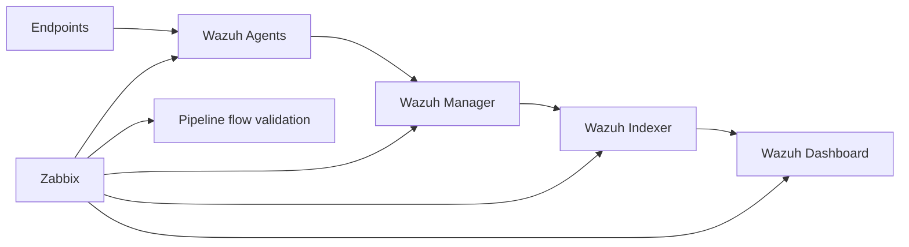

# Monitoring Wazuh with Zabbix


[](https://creativecommons.org/licenses/by/4.0/)


A practical, production-ready guide to ensuring the **reliability of your security monitoring platform**.

*Published as part of the [Wazuh Ambassadors Program](https://wazuh.com/ambassadors-program/) by [SECaaS.IT](https://security-as-a-service.io/)*

---

## Core Principle

| Platform | Role |
|---|---|
| **[Wazuh](https://wazuh.com/)** | Threat detection, log analysis, security visibility |
| **[Zabbix](https://www.zabbix.com/)** | Infrastructure monitoring, availability, platform health |

> **Without Zabbix, Wazuh can fail silently.**  
> The real risk is not an attack — it is losing the ability to detect one.

---

## Why This Matters

Wazuh is often treated as a central security component — but rarely as a **critical system that must be monitored itself**.

This repository introduces a structured approach to:
- Preventing **silent failure of detection capabilities**
- Establishing **visibility assurance across the pipeline**
- Bridging the gap between **security monitoring and infrastructure monitoring**
- Building **trust in security operations**

---

## Architecture Overview



---

## Who This Is For

- Security engineers operating Wazuh in production
- SOC teams requiring reliable early-warning indicators
- IT administrators responsible for security platform uptime
- DevOps and platform engineers integrating monitoring into security operations

---

## How to Use This Repository

- Start with **Part 1** to understand the problem space
- Follow the series sequentially for conceptual understanding
- Use the **Companion Reference** for hands-on implementation
- Best used in parallel:
  - Articles → *understanding*
  - Companion → *execution*

---

## Article Series

| # | Article | Focus |
|---|---|---|
| 1 | [Why Monitor Wazuh with Zabbix](./docs/Part-01-Why-Monitor-Wazuh-with-Zabbix.md) | Silent failure, loss of visibility, the case for infrastructure monitoring |
| 2 | [Designing Effective Monitoring for Wazuh](./docs/Part-02-Designing-Effective-Monitoring-for-Wazuh.md) | Visibility Assurance Model, three monitoring layers, designing from failure scenarios |
| 3 | [Building Your First Zabbix Checks](./docs/Part-03-Building-Your-First-Zabbix-Checks.md) | Items, triggers, testing, ownership — step by step |
| 4 | [From Metrics to Action — Alerting Strategies](./docs/Part-04-From-Metrics-to-Action.md) | Severity design, delivery reliability, escalation |
| 5 | [Operating and Maintaining Monitoring](./docs/Part-05-Operating-and-Maintaining-Monitoring.md) | Signal quality, monitoring the monitor, operational discipline |
| 6 | [From Monitoring to Trust](./docs/Part-06-From-Monitoring-to-Trust.md) | Distributed architectures, end-to-end pipeline validation, SOC maturity |

---

## Companion Implementation Reference

The article series explains the **why** and the **design**.

For step-by-step implementation — including:
- Zabbix agent installation
- PSK encryption
- Item and trigger configuration
- Notification setup
- Template design
- Scaling considerations

→ see the companion reference:

📄 [Zabbix–Wazuh Integration Guide](./docs/Companion-Reference.md)

---

## Repository Structure

```
├── README.md                          ← Entry point
└── docs/
    ├── README.md                      ← Series overview and navigation
    ├── Part-01-Why-Monitor-Wazuh-with-Zabbix.md
    ├── Part-02-Designing-Effective-Monitoring-for-Wazuh.md
    ├── Part-03-Building-Your-First-Zabbix-Checks.md
    ├── Part-04-From-Metrics-to-Action.md
    ├── Part-05-Operating-and-Maintaining-Monitoring.md
    ├── Part-06-From-Monitoring-to-Trust.md
    └── Companion-Reference.md
```

---

## Status

This repository represents a **production-tested approach** based on real-world deployments in regulated environments.

It is maintained and extended over time as practices evolve.

Validated against Wazuh 4.14.x and Zabbix 7.4.9.

---

## About SECaaS.IT

[SECaaS.IT](https://security-as-a-service.io/) provides Security-as-a-Service for organisations that need enterprise-grade security operations without building everything in-house.

This work reflects practical experience from:
- SIEM deployments in critical environments
- Operational security monitoring
- Integration of infrastructure and security observability

> *Cyber security must be built in — not bolted on.*

---

## License

This work is licensed under the **Creative Commons Attribution 4.0 International License (CC BY 4.0)**.

You are free to:
- Share and adapt the material
- Use it in your own environments and projects

As long as appropriate credit is given.

See the [LICENSE](./LICENSE) file for details.
