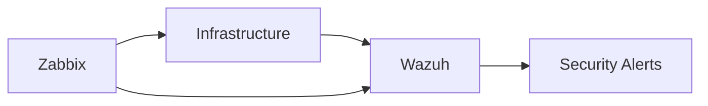

# Part 1 - Why Monitor Wazuh with Zabbix

*Part of the series: [Monitoring Wazuh with Zabbix](./README.md)*

---

## Introduction

If your Wazuh platform stops processing events - you are not "partially secure."

You are blind.

And in most cases, you don't even notice it.

Security teams frequently assume their monitoring systems are working - until an incident reveals that logs were never collected, alerts were never generated, and visibility was lost hours or even days earlier.

Wazuh is a powerful platform for threat detection, log analysis, and security monitoring. It provides deep visibility into your infrastructure and helps identify suspicious behaviour before it escalates.

But even the most advanced security platform has one fundamental requirement:

> **It must always be running, processing data, and receiving events.**

This series was written and tested against Wazuh 4.14.x and Zabbix 7.4.9.

---

## Why This Matters

Security monitoring systems fail in one of two ways:

- **Loud failure** → systems crash, alerts fire
- **Silent failure** → systems appear healthy but stop detecting

The second case is far more dangerous - because nothing tells you that you are no longer protected.

> ⚠️ **Critical insight**  
> Security systems rarely fail loudly. They fail silently.

If the Wazuh manager stops processing logs, if alerts stop flowing, or if the system silently runs out of disk space, your security monitoring becomes unreliable - without any visible indication that something is wrong.

This is exactly where infrastructure monitoring becomes critical - not as an enhancement, but as a requirement.

By integrating **Zabbix**, a powerful open-source monitoring platform, with Wazuh, you gain the ability to continuously verify that your security monitoring is actually working.

---

## What This Guide Is Not

This guide is not about installing Wazuh or Zabbix.

It is about ensuring that your security monitoring remains reliable under real-world conditions.

---

## Key Principle

> **Wazuh detects threats.**  
> **Zabbix ensures the monitoring platform itself is reliable.**

---

## The Real Risk: Loss of Visibility

The biggest risk in security operations is not an attack.

It is losing the ability to detect attacks.

This can happen in subtle ways:

- The Wazuh manager process crashes
- Log files stop updating
- The alert pipeline becomes blocked
- Disk space is exhausted
- System resources are saturated

These failures often remain unnoticed - until it is too late.

### Real-world failure scenario

- Wazuh manager crashes at 02:13 AM
- No alerts are generated
- A security incident occurs at 03:00 AM
- The SOC sees nothing
- The issue is discovered days later

This is not theoretical. It happens in real environments.

From our experience at **[SECaaS.IT](https://security-as-a-service.io/)**, monitoring reliability is treated as a **critical control**: if it is not actively verified, security visibility cannot be trusted.

---

At this point, the question is no longer "Do we have a monitoring system?"

The real question becomes:

> **How do we ensure that our monitoring system is actually working?**

---

## How Zabbix Complements Wazuh

Zabbix introduces a second layer of visibility. It does not replace Wazuh - it protects it.

*Figure 1: Zabbix monitors both the system and the monitoring pipeline itself.*

- **Wazuh** analyses logs and detects threats
- **Zabbix** monitors system health and service availability
- **Zabbix** monitors Wazuh's services and alerts on failures

Together, they create a layered model:

- Wazuh → detects threats
- Zabbix → ensures detection is possible

---

## A Simple Mental Model

Think of your security monitoring like an aircraft:

- **Wazuh = the radar system**
- **Zabbix = the system diagnostics**

If the radar fails silently, the pilot still believes everything is fine. Monitoring Wazuh with Zabbix ensures your radar is always operational.

---

## Why Build Monitoring Manually?

You may already know that prebuilt Zabbix templates for Wazuh exist. They are convenient - but they hide complexity.

In this series, we deliberately take a different approach.

Instead of importing a ready-made template, you will **build your monitoring configuration manually**.

> Templates optimise for convenience.  
> This series optimises for understanding.

This approach allows you to fully understand:

- what is being monitored
- why it is monitored
- how thresholds and triggers are defined
- how alerts are escalated and handled

### Benefits of this approach

**Real understanding** - you learn how Zabbix works internally, enabling you to troubleshoot and improve your monitoring over time.

**No black boxes** - you avoid hidden assumptions and unnecessary checks.

**Flexibility** - your monitoring reflects your architecture, not a generic template.

**Transferable skills** - the same principles apply to any system you operate.

---

## What Are Zabbix and Wazuh?

Before going further, it is useful to clearly separate their roles.

### [Zabbix](https://www.zabbix.com/)

Zabbix is a mature open-source monitoring platform focused on **infrastructure and availability**.

Typical capabilities include:

- monitoring processes and services
- tracking CPU, memory, and disk usage
- analysing log files
- detecting anomalies
- sending alerts via multiple channels

Zabbix answers questions such as: Is a service running? Are system resources being exhausted? Are logs still updating?

### [Wazuh](https://wazuh.com/)

Wazuh is an open-source security platform focused on **threat detection and analysis**.

It provides log analysis, intrusion detection, vulnerability detection, configuration assessment, and compliance monitoring. It collects and analyses events from across your infrastructure to detect suspicious behaviour.

### Clear role separation

| | Wazuh | Zabbix |
|-|-|-|
| Primary function | Threat detection | Infrastructure monitoring |
| Analyses | Security events | System metrics and logs |
| Answers | "Is something attacking us?" | "Is our detection system working?" |
| Generates | Security alerts | Operational alerts |

Together:

> **Wazuh detects threats.  
> Zabbix ensures the system detecting those threats is reliable.**

---

## What You Will Learn in This Series

This series builds a practical monitoring setup for a Wazuh deployment, progressing from design to implementation to operations.

You will learn how to:

- identify critical health indicators of Wazuh
- design monitoring checks that detect failures early
- create Zabbix items to collect meaningful data
- define triggers that turn metrics into alerts
- implement notification and escalation strategies
- integrate alerts with systems such as email, messaging platforms, or automation tools like **n8n**

By the end, you will not only have a working setup - you will understand how to design reliable monitoring systems.

---

## Who Should Read This Series?

- Security engineers operating Wazuh
- System administrators responsible for platform uptime
- SOC teams requiring reliable detection infrastructure
- DevOps and platform engineers

Basic Linux and monitoring familiarity is helpful. No deep Zabbix expertise is required.

---

## How This Series Works

| Part | Focus |
|-|-|
| Part 1 (this article) | Why monitoring Wazuh is critical |
| Part 2 | Designing effective monitoring - the Visibility Assurance Model |
| Part 3 | Building your first Zabbix checks - implementation |
| Part 4 | Alerting strategies - from metrics to action |
| Part 5 | Operating and maintaining monitoring over time |
| Part 6 | Scaling to distributed Wazuh environments |

---

## A Hard Truth

Many organisations invest heavily in threat detection - but fail to monitor whether their detection systems are actually working.

This creates a dangerous false sense of security. Reliable security requires more than visibility. It requires **trust in that visibility**.

---

## Looking Ahead

Now that we understand **why monitoring Wazuh is critical**, the next step is to design it properly.

In Part 2, we move from problem awareness to monitoring design:

> **What exactly should you monitor - and why?**

Instead of collecting large amounts of data, we will focus on a small number of **high-value signals** that reveal when something is wrong. This is the foundation of effective monitoring - and the key to ensuring that your security monitoring never fails silently.

---

*[← Series Overview](./README.md) · [Part 2 → Designing Effective Monitoring for Wazuh](./Part-02-Designing-Effective-Monitoring-for-Wazuh.md)*
