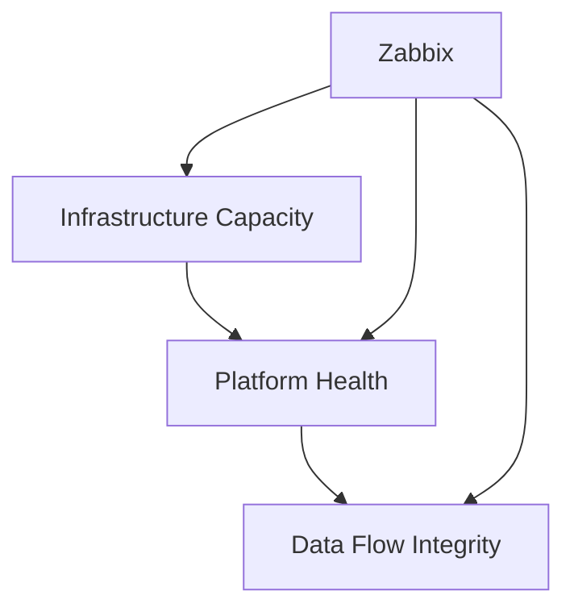

# Part 2 - Designing Effective Monitoring for Wazuh

*Part of the series: [Monitoring Wazuh with Zabbix](./README.md)*

---

## Introduction

In Part 1, we established a critical truth:

> **Security monitoring is only valuable if it is continuously working.**

Now the question becomes:

> **What exactly should you monitor to ensure that Wazuh is doing its job?**

A common mistake in monitoring design is collecting too many metrics without understanding their purpose. More data does not mean better monitoring. It often means more noise.

Effective monitoring focuses on **a small number of high-value signals** that clearly indicate when something is wrong.

At **SECaaS.IT**, we follow a simple rule:

> Monitor what threatens your visibility - not everything that exists.

> **Scope note**  
> This article focuses on a single-node Wazuh deployment.  
> Multi-node and distributed environments are covered in Part 6.

---

## The Core Principle: Monitor for Loss of Visibility

When designing monitoring for Wazuh, the primary goal is not performance optimisation.

It is **ensuring continuous detection capability**.

The real risk is not high CPU usage or temporary load spikes. The real risk is:

> **Wazuh silently stops detecting threats.**

This can happen in multiple ways:

- Wazuh manager process stops
- Logs are no longer processed
- Alerts are no longer generated
- Disk space prevents writes
- Pipeline components fail (e.g. Filebeat)
- System overload delays processing

Your monitoring must detect these conditions early - before they become invisible gaps in your security coverage.

---

## The Visibility Assurance Model

At **SECaaS.IT**, we structure monitoring using a model built around three questions:

1. Is the platform running?
2. Is the platform processing data?
3. Can the platform continue operating?

We call this the **Visibility Assurance Model**.



*Figure 1: Three-layer monitoring model for Wazuh reliability.*

- **Infrastructure Capacity** ensures the system can operate
- **Platform Health** ensures services are running
- **Data Flow Integrity** ensures detection is actually happening

If any layer fails → **security visibility is compromised**.

> ⚠️ **Critical insight**  
> A running service does NOT guarantee a working detection pipeline.

---

## A Decision Framework for Every Check

Before adding any monitoring check, ask three questions:

1. Does it detect complete failure?
2. Does it detect silent degradation?
3. Does it predict future failure?

If the answer is **none of these**, the check is likely not valuable.

Good monitoring is not about collecting data. It is about detecting failure early.

---

## The Three Monitoring Layers

### Layer 1 - Platform Health

**Question:** Is Wazuh running?

**Key checks:**

- Wazuh manager process
- Filebeat service (if used)
- Wazuh indexer (in larger setups)
- Unexpected service restarts or crashes

**Example failure:**

`wazuh-manager` process stops → no log processing → no alerts generated.

**Monitoring priority:** Critical

---

### Layer 2 - Data Flow Integrity

**Question:** Is Wazuh actively detecting and generating alerts?

This is the **most important layer**.

A system can appear completely healthy while silently failing. Process monitoring alone cannot detect this - which is exactly why this layer exists.

**Key signals:**

- Alert log freshness (`alerts.json` last modification time)
- Event ingestion activity
- Alert generation rate
- Pipeline delays or blockages

**Example failure:**

`alerts.json` stops updating → no alerts being generated → detection pipeline is broken, with no visible process failure.

**Why this matters:**

In one environment, alert generation stopped for over 20 minutes while all services appeared to be running. The root cause was a stalled pipeline component. The only indicator was a frozen alert log timestamp. No process had crashed. No error was visible on the dashboard.

This is exactly the category of failure that process monitoring cannot catch - and why Data Flow Integrity is the most critical layer to instrument.

**Monitoring priority:** High

---

### Layer 3 - Infrastructure Capacity

**Question:** Can Wazuh continue operating reliably?

**Key metrics:**

- Disk usage
- CPU load
- Memory usage
- System uptime

**Example failure:**

Disk full → logs cannot be written → alerts are lost → Wazuh may crash.

Infrastructure checks are often the **earliest indicators** of problems that will eventually affect Wazuh itself. A disk filling gradually gives you time to act; a disk that is already full gives you none.

**Monitoring priority:** High

---

## Key Monitoring Items - Practical Baseline

The following table defines a minimal but effective starting set.

| Monitoring item | What to check | Why it matters | Severity |
|-|-|-|-|
| Wazuh manager process | `proc.num[wazuh-manager]` | Core event processing stops if down | Critical |
| Alerts log freshness | `alerts.json` modification time | Detects pipeline failure invisibly | High |
| Error log entries | ERROR patterns in `ossec.log` | Early warning of internal failures | Warning / High |
| Disk usage | `/var` or `/` filesystem | Prevents log write failures | High |
| CPU utilisation | `system.cpu.util` | High load delays event processing | Warning |
| Memory usage | RAM consumption | Memory exhaustion can crash services | Warning |
| Filebeat status | Process running | Alerts may not reach the indexer | High |
| System uptime | Host availability | Detects unexpected restarts | Info |

Start with this set. It provides immediate visibility with low noise and high value. Extend it based on operational experience, not speculation.

---

## Example: Designing a High-Value Check

Let's walk through a real monitoring design decision.

**Scenario:** You want to detect if Wazuh stops generating alerts.

**Signal:**

```
/var/ossec/logs/alerts/alerts.json
```

**Why this works:**

Every alert Wazuh generates is written to this file. If the modification timestamp stops advancing, something in the processing pipeline has failed - regardless of whether any service has crashed.

**Monitoring logic:**

Check the file modification time. Compare it with the current system time.

**Example threshold:**

```
Alert log not updated for 10 minutes → trigger alert
```

**What this single check can detect:**

- Wazuh manager crash
- Pipeline component failure
- Disk write failure
- Resource exhaustion causing processing delays

> One signal → multiple failure scenarios. This is high-quality monitoring design.

---

## Designing Monitoring Like a SOC Engineer

In mature SOC environments, monitoring is not built bottom-up from available metrics. It is designed top-down from failure scenarios.

**Wrong approach:**

- Monitor everything available
- Add dozens of checks
- Hope something catches a problem

**Correct approach:**

Ask first:

- What breaks detection?
- What causes silent failure?
- What must never stop?

Then design checks that answer those questions directly.

---

## Common Monitoring Anti-Patterns

These patterns appear repeatedly in real environments and consistently undermine monitoring effectiveness:

| Anti-pattern | Why it fails |
|-|-|
| Monitoring everything | Creates noise instead of clarity |
| Monitoring only processes | Misses silent pipeline failures |
| No clear thresholds | Produces no actionable alerts |
| Alerts without ownership | No one responds |
| Overly sensitive triggers | Alert fatigue - critical signals get ignored |

Avoiding these mistakes is as important as designing the right checks.

---

## Beyond the Baseline

As your environment and operational experience grow, extend your monitoring accordingly.

**Examples of useful additions:**

- Agent connectivity - detect sudden drops in connected agent count
- Indexer cluster health - especially in multi-node deployments
- API availability
- TLS certificate expiration
- Rule update and vulnerability feed status

**The principle:**

> Expansion should follow operational experience - not speculation.

Add new checks when real incidents or near-misses reveal a gap, not because a metric exists and can be collected.

---

## Summary

In this article, you learned:

- Why monitoring must focus on detecting loss of visibility, not on collecting metrics
- How to structure monitoring using the Visibility Assurance Model
- Which signals matter most for a Wazuh deployment
- How to design high-value checks from failure scenarios
- How to avoid the most common monitoring anti-patterns

> ⚠️ **One important note before the next step**  
> Even perfectly designed monitoring is ineffective if alerts are not reliably delivered.  
> Alert delivery reliability is addressed in depth in Part 4.

---

## Looking Ahead

Now that you understand **what to monitor and why**, the next step is implementation.

In Part 3, we move from design to execution:

> **How do you build these checks in Zabbix - step by step?**

You will learn how to create Zabbix items, monitor processes and log files, define triggers that make data meaningful, and establish the foundation for the alerting strategies covered in Part 4.

---

*[← Part 1: Why Monitor Wazuh with Zabbix](./Part-01-Why-Monitor-Wazuh-with-Zabbix.md) · [Part 3 → Building Your First Zabbix Checks](./Part-03-Building-Your-First-Zabbix-Checks.md)*
