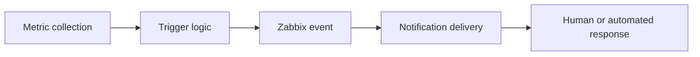

# Part 4 - From Metrics to Action: Alerting Strategies

*Part of the series: [Monitoring Wazuh with Zabbix](./README.md)*

---

## Introduction - Where Monitoring Either Works or Fails

At this point in the series, your Zabbix instance is collecting metrics and evaluating triggers. From a technical perspective, the monitoring layer is in place.

From an operational perspective, this is only half the job.

> **Monitoring that does not lead to action is indistinguishable from no monitoring at all.**

In real environments, failures rarely happen because metrics were missing. They happen because:

- alerts were ignored
- alerts were unclear
- alerts never arrived
- alerts reached the wrong people

This is where monitoring transitions into **operations** - and where the design decisions you make have the most direct impact on your organisation's ability to respond to real incidents.

Building on the previous articles:

- Part 1 → monitoring is required to avoid blind spots
- Part 2 → monitoring must be designed to detect loss of visibility
- Part 3 → items and triggers define meaningful signals

This article completes the operational chain:

> **Detection → Monitoring → Alerting → Response**

---

## The Alerting Pipeline

To design alerting correctly, you must understand each stage clearly.



*Figure 1: The full alerting pipeline - value only materialises at the final stage.*

- Metrics provide raw data
- Triggers interpret the data
- Events represent detected problems
- Notifications deliver information to people or systems
- Response resolves the issue

> **Most monitoring failures occur between "event" and "response."**  
> The problem was detected. The right person was never informed - or was informed too late.

---

## Designing Meaningful Severity Levels

Not every alert deserves the same attention. Severity must reflect **operational impact**, not technical magnitude.

| Severity | Meaning | Example | Expected action |
|-|-|-|-|
| Information | No action required | System restart completed | Observe; log for trend analysis |
| Warning | Potential issue developing | CPU above 90% for 5 minutes | Investigate during normal hours |
| High | Degradation or confirmed risk | Alert log stale; disk above 85% | Investigate promptly |
| Disaster | Loss of visibility or detection | Wazuh manager process down | Immediate response required |

### The key insight on severity

High CPU is not necessarily a disaster. A Wazuh manager that has stopped processing events **is** - because it means detection has stopped.

> **The goal is not to protect infrastructure. It is to protect visibility.**

Severity decisions should always be made in terms of impact on detection capability, not on system metrics alone.

### A practical test for every trigger

Before assigning a severity level, ask:

> "If this alert fires at 3 AM, does someone need to act immediately?"

- If yes → `High` or `Disaster`
- If it can wait until morning → `Warning`
- If no action is ever needed → `Information`, or reconsider whether the trigger should exist at all

---

## Configuring Notifications in Zabbix

Zabbix delivers alerts through two components: **Media Types** and **Actions**. Understanding both is essential for designing a reliable notification workflow.

### Media Types

A Media Type defines how a notification is delivered. Zabbix supports a wide range of delivery mechanisms out of the box.

**Navigate to:** `Administration → Media types`

Common media types and their use cases:

| Media type | Typical use | Notes |
|-|-|-|
| Email | Primary or secondary channel | Reliable; asynchronous |
| Webhook | Integration with Teams, Slack, n8n, ticketing systems | Powerful; dependent on external services |
| SMS gateway | High-priority fallback | Bypasses internet-dependent channels |
| Script | Custom delivery logic | Maximum flexibility |

Each media type requires configuration of its delivery parameters - SMTP settings for email, API endpoint and payload format for webhooks.

### Assigning media to users

Once a media type exists, assign it to users who should receive notifications.

**Navigate to:** `Administration → Users → [User] → Media`

For each assignment, configure:

- notification method (which media type)
- destination address or endpoint
- active time periods (e.g. only during business hours, or 24/7)
- minimum severity threshold for this channel

This allows different team members to receive alerts appropriate to their role and working hours.

**Example routing by role:**

| Role | Primary channel | Secondary channel | Active hours |
|-|-|-|-|
| SOC analyst | Messaging platform | Email | 24/7 |
| System administrator | Email | - | Business hours |
| On-call engineer | Webhook / SMS | Messaging platform | Outside business hours |

### Configuring Actions

Actions define what happens when a trigger fires - who is notified, how, and in what sequence.

**Navigate to:** `Configuration → Actions → Trigger actions → Create action`

An action consists of three components:

**Conditions** - when the action executes.

Example conditions:
- Trigger severity is `High` or above
- Host group is `Wazuh Servers`
- Trigger name contains `Wazuh`

**Operations** - who is notified and how.

Example:
- Send email to the operations team
- Post webhook to the n8n automation endpoint
- Notify the SOC channel via messaging integration

**Recovery operations** - what happens when the problem resolves.

Example:
- "Wazuh Manager process restored - monitoring confirms normal operation"

Recovery notifications are as important as problem notifications. They confirm that the incident is resolved and allow teams to close tickets and stop escalating.

### A complete Action configuration example

Below is a concrete example for the "Wazuh Manager is not running" trigger.

**Action name:** `Wazuh - Critical alert response`

**Conditions:**
- Trigger severity ≥ `High`
- Host group = `Wazuh Servers`

**Operations - Step 1 (immediate):**
- Send message to SOC team via messaging platform
- Message subject: `[CRITICAL] {HOST.NAME} - {TRIGGER.NAME}`
- Message body:
  ```
  Host:     {HOST.NAME}
  Problem:  {TRIGGER.NAME}
  Severity: {TRIGGER.SEVERITY}
  Time:     {EVENT.DATE} {EVENT.TIME}
  
  Impact:   Security events are no longer being processed.
  Action:   Restart wazuh-manager. Investigate root cause.
            systemctl restart wazuh-manager
  
  Zabbix:   {TRIGGER.URL}
  ```

**Operations - Step 2 (5 minutes if unacknowledged):**
- Send email to platform team lead
- Post webhook to incident management system

**Recovery operations:**
- Send message to SOC team: `[RESOLVED] {HOST.NAME} - {TRIGGER.NAME} has cleared.`

The message body template above is important. Alerts that include the host name, problem description, impact statement, and a suggested first action dramatically reduce the time between notification and response. An operator receiving this alert at 3 AM does not need to open a runbook - the essential context is in the message.

---

## The Hidden Risk: Alert Delivery Failure

Most monitoring strategies assume that once an alert is triggered, it will reliably reach the responsible team. In practice, this assumption is dangerous.

Alert delivery depends on external systems that can fail independently of your monitoring infrastructure:

- Email providers experience outages or rate-limit bulk sending
- Microsoft Teams and Slack have service disruptions
- Webhook endpoints become unreachable
- Cloud-based automation platforms experience API failures

### Real-world failure scenario

- Zabbix detects a critical failure in the Wazuh pipeline
- A webhook fires to the Microsoft Teams integration
- Teams experiences a temporary service disruption
- No notification is delivered
- The incident remains undetected

From an operational perspective:

> **The alert existed. The response never happened.**

> **An alert that is not delivered is equivalent to no alert at all.**

This failure mode is not rare. It occurs in real production environments - almost always at the worst possible moment.

---

## Designing for Alert Delivery Reliability

Reliable alerting requires designing for failure - not assuming delivery.

### 1. Use multiple notification channels

Never rely on a single delivery mechanism for critical alerts.

**Example multi-channel strategy:**

| Severity | Channel 1 | Channel 2 | Channel 3 |
|-|-|-|-|
| Warning | Email | - | - |
| High | Email | Messaging platform | - |
| Disaster | Messaging platform | Email | Webhook to incident system |

When one channel fails, another delivers the alert independently.

### 2. Avoid single points of failure

Every external notification dependency is a potential single point of failure. Ask for each channel:

> "What happens if this system is unavailable for 30 minutes?"

If the answer is "no one gets notified," that is a gap that needs addressing.

### 3. Consider out-of-band channels for critical alerts

For environments where detection failure carries significant risk, add notification channels that operate independently of internet-connected services:

- SMS gateways (operate independently of cloud messaging platforms)
- Direct phone call alerts via on-call systems (PagerDuty, Opsgenie)
- Local SNMP traps to a separate monitoring receiver

### 4. Monitor alert delivery itself

In mature environments, alert delivery is treated as a monitored system - not a static configuration assumed to be working.

Practical approaches:

- Track webhook response codes in Zabbix (HTTP agent items can verify endpoint availability)
- Use Zabbix's built-in media type test function periodically: `Administration → Media types → Test`
- Establish a regular cadence of notification tests - send a synthetic test alert through each channel and confirm receipt

### 5. Track alert acknowledgment

In mature environments, delivery alone is not sufficient. It must be clear whether an alert has been:

- received
- acknowledged
- acted upon

Zabbix supports alert acknowledgment natively. In critical environments, configure escalation to continue until an alert is explicitly acknowledged - not just delivered.

This ensures that a delivered-but-unread alert does not silently expire without response.

---

## Escalation Strategies and Operational Ownership

Alerting is not just delivery - it is responsibility.

### Key questions for every alert

- Who owns this alert?
- Who is notified first?
- What happens if no one responds within a defined time window?

### Example escalation model

| Time after trigger | Action |
|-|-|
| 0 minutes | Notify primary team (SOC or platform) |
| +5 minutes | Notify secondary contact if unacknowledged |
| +15 minutes | Escalate to on-call engineer |
| +30 minutes | Notify team lead or manager |

> **Unowned alerts are ignored alerts.**

### Implementing escalation in Zabbix

Escalation is implemented through **Action operations** with multiple steps and time delays.

In `Configuration → Actions → [Action] → Operations`, each step has:

- a step number
- a time delay before this step executes
- a recipient and delivery method
- a condition (e.g. "only if not acknowledged")

**Example escalation steps for a Disaster-severity alert:**

| Step | Delay | Recipient | Condition |
|-|-|-|-|
| 1 | 0s | SOC team - messaging channel | Always |
| 2 | 5m | Platform team lead - email | Not acknowledged |
| 3 | 15m | On-call engineer - webhook / SMS | Not acknowledged |

This ensures that alerts are not only delivered - they are **actively followed until resolved**.

---

## Avoiding Alert Fatigue

Too many alerts destroy the effectiveness of a monitoring system. In many environments, alerts are technically correct but operationally ineffective - they lack context, have unclear ownership, and generate so much volume that operators begin ignoring them.

When that happens, critical alerts get buried in noise.

### Common anti-patterns that cause alert fatigue

| Anti-pattern | Effect |
|-|-|
| Alerting on every metric fluctuation | Operators stop trusting alerts |
| No severity differentiation | Everything feels equally urgent - nothing is |
| Overly sensitive thresholds | Constant false positives erode confidence |
| No trigger dependencies | One root cause generates dozens of alerts |
| Alerts without context | Operators spend time investigating what happened, not fixing it |

### Practical techniques to reduce noise

**Time-based evaluation windows**

Instead of:
```
CPU > 90%
```

Use:
```
min(/host/system.cpu.util[,avg1],5m) > 90
```

The trigger only fires if CPU has been above 90% for the entire 5-minute window - not on a brief spike.

**Trigger dependencies**

If a host becomes unreachable, all service-level checks on that host will also fail, generating a cascade of alerts from a single root cause.

Use trigger dependencies to suppress child alerts when the root cause is already known.

**Navigate to:** `Configuration → Hosts → [Host] → Triggers → [Trigger] → Dependencies`

Example:
- "Host unreachable" trigger exists
- "Wazuh Manager not running" depends on it
- If the host is unreachable, the process alert is suppressed

**Contextual alert messages**

Every alert should include enough information for an operator to act without needing to open another tool. As shown in the Action configuration example earlier, include: host, problem, impact, and suggested first action.

---

## Avoiding Alert Fatigue - Signal Quality Over Noise Volume

The goal of alerting is not to detect everything. It is to ensure that nothing critical is missed.

A monitoring system with 10 high-quality, well-owned alerts is operationally superior to one with 200 alerts that have degraded into background noise.

Review your alerts regularly. If a trigger fires frequently without generating a response, it is either:

- a false positive (threshold too sensitive → adjust it), or
- a real problem that has been normalised (the team has stopped caring → that is a different, more serious problem)

Both require action. Neither should be left alone.

---

## End-to-End Workflow Example

Let us trace the complete alerting lifecycle for the most critical scenario in this series.

**Scenario:** Wazuh stops generating alerts.

**Step 1 - Metric**
Zabbix polls `vfs.file.time[/var/ossec/logs/alerts/alerts.json,modify]` every 60 seconds.

**Step 2 - Trigger**
The expression `(now()-last(...))>600` evaluates to true after 10 minutes without an update.

**Step 3 - Event**
Zabbix creates a problem event: `Wazuh - no alerts generated in the last 10 minutes` / Severity: High.

**Step 4 - Notifications**
- Messaging platform alert → SOC team
- Email → operations team
- Webhook → incident management system

**Step 5 - Escalation**
If unacknowledged after 5 minutes → on-call engineer notified via secondary channel.

**Step 6 - Response**
SOC engineer investigates. Identifies stalled Filebeat process. Restarts the service.

**Step 7 - Recovery**
`alerts.json` begins updating. Trigger clears. Zabbix sends recovery notification to all channels.

**Step 8 - Post-incident**
Trigger threshold and escalation path are reviewed. Monitoring check for Filebeat process status is added (it was on the monitoring backlog; this incident confirms it is needed).

> **This is the difference between monitoring and operational control.**

---

## Extending the Operational Model

We can now state the complete operational chain for this series:

> **Wazuh detects threats.**  
> **Zabbix ensures detection works.**  
> **Alerting ensures that detection leads to response.**

This completes the chain introduced in Part 1:

> **Detection → Monitoring → Alerting → Response**

If any part of this chain fails, the system becomes ineffective - even if every other part is working perfectly.

---

## SECaaS.IT Perspective

From real-world environments at **SECaaS.IT**, one pattern is consistent:

> Alerts rarely fail because of bad detection - they fail because of bad delivery or unclear ownership.

As a **Wazuh Ambassador**, we have observed:

- alerts sent to channels that no one actively monitors
- critical alerts buried in high-volume warning noise
- single notification channels failing silently during incidents
- alerts delivered but never acknowledged, with no escalation path

The result is predictable: delayed response, undetected outages, and loss of the security visibility that the entire monitoring system was built to protect.

> **Detection is only valuable if it reliably leads to action.**

---

## Summary

In this article, you learned:

- how to design severity levels that reflect operational impact, not just technical state
- how to configure Zabbix Media Types, Users, and Actions for reliable notification delivery
- how to construct complete Action configurations with contextual alert messages
- why alert delivery failure is a real and underappreciated risk
- how to design for delivery reliability using multiple channels
- how to implement escalation paths that ensure alerts are acted upon
- how to reduce alert fatigue through threshold design, trigger dependencies, and signal quality thinking

> **Reliable alerting is not about sending notifications.**  
> **It is about ensuring response under real-world conditions.**

---

## Looking Ahead

At this point, you have meaningful checks, working triggers, and a structured alerting system.

But monitoring is not static. Infrastructure changes, thresholds drift, notification paths break, and teams change. A monitoring system that is not actively maintained will degrade - often silently, in exactly the same way that Wazuh itself can degrade without monitoring.

In Part 5, we focus on **operating monitoring as a living system**:

- maintaining signal quality over time
- verifying that the monitoring system itself is working
- troubleshooting common failure modes
- building the operational discipline that keeps monitoring trustworthy

> **A monitoring system that is not maintained will eventually fail - silently.**

---

*[← Part 3: Building Your First Zabbix Checks](./Part-03-Building-Your-First-Zabbix-Checks.md) · [Part 5 → Operating and Maintaining Monitoring](./Part-05-Operating-and-Maintaining-Monitoring.md)*
