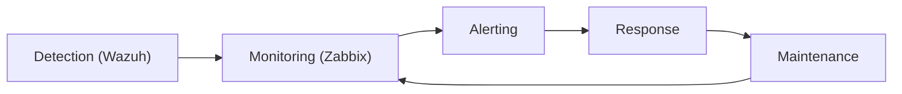

# Part 5 - Operating and Maintaining Monitoring

*Part of the series: [Monitoring Wazuh with Zabbix](./README.md)*

---

## Introduction - Monitoring Is Not a One-Time Setup

At this stage in the series, you have:

- defined meaningful checks aligned to the Visibility Assurance Model
- implemented Zabbix items and triggers with field-level precision
- built alerting workflows with escalation paths and delivery reliability

From a technical perspective, your monitoring is working.

From an operational perspective, this is where the real work begins.

> **Monitoring that is not actively maintained will degrade - often silently.**

In real environments, monitoring systems do not fail because they were poorly designed. They fail because:

- thresholds become outdated as system behaviour changes
- infrastructure changes are not reflected in monitoring configuration
- alerts become noisy and are progressively ignored
- notification paths break without anyone noticing
- ownership becomes unclear as teams change

This article focuses on operating monitoring as a **living system** - one that requires the same operational discipline as the infrastructure it protects.

---

## The Operational Model - Monitoring as a Feedback Loop

In the earlier articles, we built monitoring around a linear chain:

> **Detection → Monitoring → Alerting → Response**

In production, an essential fifth stage appears:

> **Maintenance**



*Figure 1: Monitoring is not linear - it is a feedback loop. Every incident, alert, and near-miss should improve the monitoring system itself.*

Maintenance is not administration. It is the continuous process of learning from operational experience and applying that learning back into the monitoring system.

Every alert that fires is information - not just about the infrastructure, but about whether the monitoring system is calibrated correctly. Every incident is an opportunity to close a gap. Every false positive is a signal that a threshold needs adjustment.

---

## The Primary Goal: Sustained Visibility

All maintenance activities in this article serve one purpose:

> **Ensuring that security visibility is never lost - even as systems evolve.**

Monitoring does not fail suddenly. It degrades:

- alerts become noisy; operators begin ignoring them
- thresholds drift away from reflecting real system behaviour
- a webhook integration silently stops delivering
- a critical check stops collecting data and shows "Not Supported" without anyone noticing

Over weeks or months, this gradual degradation creates exactly the situation the monitoring system was built to prevent:

> **A false sense of operational confidence while visibility has quietly eroded.**

The purpose of operating monitoring is to continuously verify that detection remains possible - not to assume it.

---

## Maintaining Signal Quality

One of the fastest ways to destroy a monitoring system is alert noise. When operators receive too many alerts, they begin filtering them cognitively - and critical alerts get missed alongside the noise.

> **Too many alerts → no alerts are trusted.**

### The common degradation pattern

1. Initial setup → clean, meaningful alerts
2. Additional checks are added without review
3. Thresholds are not adjusted as system behaviour changes
4. Alert volume increases
5. Teams start acknowledging alerts without investigating
6. A critical alert is missed because it looks like noise

This pattern is not a failure of monitoring design. It is a failure of monitoring operations.

### Practical maintenance tasks for signal quality

Perform these on a regular schedule:

| Task | Purpose | Recommended frequency |
|-|-|-|
| Review triggered alerts | Identify noise, false positives, and ignored signals | Weekly |
| Adjust trigger thresholds | Align with observed system behaviour | Monthly or after incidents |
| Remove or disable unused checks | Reduce complexity and noise | Quarterly |
| Validate severity assignments | Ensure critical alerts remain distinguishable | Quarterly |
| Review alert acknowledgment patterns | Identify alerts being acknowledged but not resolved | Monthly |

### Example: improving a noisy trigger

**Before (too sensitive):**
```
CPU > 80%
```

This fires during normal peak load, generating alerts that require no action and training operators to ignore CPU alerts.

**After (operationally calibrated):**
```
min(/host/system.cpu.util[,avg1],5m) > 90
```

This fires only when CPU has been sustained above 90% for a full 5-minute window - a condition that genuinely warrants investigation.

> **Monitoring quality is defined by what you can safely ignore - not by what you collect.**

---

## Verifying Monitoring and Alerting Reliability

A critical but frequently overlooked question:

> **Who monitors the monitoring system?**

As established in Part 4, alert delivery failure is a real and underappreciated risk. This risk does not diminish once the system is running - it increases over time as integrations evolve, external services change, and dependencies accumulate.

Alert delivery must be treated as a **monitored system in its own right** - not a static configuration assumed to be working.

### The three things you must continuously verify

1. Monitoring is collecting data (items are not silently failing)
2. Triggers are evaluating correctly (logic has not drifted from reality)
3. Alerts are being delivered (notification channels are functional)

Failing to verify any of these creates a gap between the monitoring system you believe you have and the one that is actually operating.

### Practical validation checks

#### Item freshness monitoring

Detect silent data collection failures using the `nodata()` function:

```
nodata(/host/system.cpu.util[,avg1],300)=1
```

This fires if no data has been received from the item for 5 minutes. It detects agent failures, connectivity issues, and silent collection breakdowns - all of which would otherwise make your monitoring appear functional while actually collecting nothing.

Apply `nodata()` triggers to your most critical items: the process check, the alert log freshness item, and disk usage.

#### Heartbeat checks

Create a synthetic signal specifically to validate the end-to-end monitoring pipeline:

- A script runs periodically on the Wazuh host and updates a timestamp file or custom metric
- Zabbix monitors that metric using a `nodata()` trigger
- If the metric stops updating, the monitoring pipeline itself has a problem

This is the monitoring equivalent of the alert log freshness check - but for Zabbix itself.

**Example: simple heartbeat using a UserParameter**

Add to `/etc/zabbix/zabbix_agent2.conf`:
```
UserParameter=monitoring.heartbeat,date +%s
```

Create a Zabbix item:
```
Key:  monitoring.heartbeat
Type: Zabbix agent
```

Create a trigger:
```
nodata(/host/monitoring.heartbeat,300)=1
```

If this fires, the agent is not communicating with the Zabbix server - meaning none of your monitoring items are collecting data.

#### Regular notification channel testing

Test each notification channel on a defined schedule - do not wait for an incident to discover that a webhook has been broken for three weeks.

**In Zabbix:** `Administration → Media types → [Media type] → Test`

This sends a test notification through the configured channel. Confirm receipt at the destination.

For webhook-based integrations (Teams, Slack, n8n), consider creating a Zabbix HTTP agent item that periodically checks the endpoint's availability:

| Field | Value |
|-|-|
| Name | `Webhook endpoint - Teams integration reachable` |
| Type | `HTTP agent` |
| URL | `https://your-teams-webhook-endpoint` |
| Request method | `HEAD` |
| Expected status codes | `200` |
| Update interval | `300s` |

Pair this with a trigger that fires if the endpoint returns an unexpected status or becomes unreachable. This is particularly valuable because Teams and Slack integrations can silently expire or be revoked.

#### Alert acknowledgment review

Regularly audit acknowledgment patterns in Zabbix:

**Navigate to:** `Monitoring → Problems`

Look for:
- alerts acknowledged rapidly but not resolved (may indicate operators clearing noise without acting)
- alerts that escalated to step 2 or 3 before being acknowledged (may indicate a staffing or notification gap)
- alerts that were never acknowledged (a critical gap - someone should have responded)

These patterns reveal the difference between a monitoring system that is technically generating alerts and one that is operationally driving response.

---

## Troubleshooting Common Monitoring Failures

Even well-designed monitoring setups encounter problems. The key is to troubleshoot systematically rather than reactively.

### Item shows "Not Supported"

**Symptoms:** An item stops collecting data. Zabbix marks it "Not Supported" in the Latest Data view.

**Common causes:**
- Incorrect item key
- File or service no longer exists at the expected path
- Permission denied (particularly common for log file monitoring)
- Agent configuration issue

**Troubleshooting steps:**

Check the Zabbix agent log on the monitored host:
```bash
tail -100 /var/log/zabbix/zabbix_agent2.log | grep -i error
```

Test the key manually. For a process check:
```bash
ps aux | grep wazuh-manager | grep -v grep | wc -l
```

For a file existence check:
```bash
ls -l /var/ossec/logs/alerts/alerts.json
```

For a permission issue on log monitoring:
```bash
sudo -u zabbix cat /var/ossec/logs/ossec.log | head -5
```

If the last command fails with "permission denied", the `zabbix` user does not have read access to the file. Revisit the group membership setup from Part 3.

---

### Alerts never trigger despite data changing

**Symptoms:** An item is collecting data and the value changes, but the associated trigger never fires.

**Check:**
- Open `Monitoring → Latest Data` and confirm the item value is crossing the threshold
- Navigate to the trigger and use `Configuration → Hosts → Triggers → [Trigger]` to review the expression
- Use the trigger expression testing tool: in the trigger editor, click **Test** to evaluate the expression against current values

**Common cause:** A syntax error or incorrect host reference in the trigger expression. When using the Zabbix UI trigger builder, ensure the host reference in the expression matches exactly the hostname configured in Zabbix (not the DNS name or IP address, unless that is how the host was added).

---

### Alerts fire too frequently

**Symptoms:** A trigger generates repeated alerts for the same condition, or fires and clears rapidly in a loop.

**Solutions:**

- Increase the evaluation window: change `last()` to `min(...,5m)` or `avg(...,5m)` to require the condition to be sustained before triggering
- Add a **hysteresis** condition: use different thresholds for problem and recovery to prevent rapid cycling. For example, trigger at >90%, recover only when value drops below 80%
- Check whether the underlying condition is genuinely oscillating - if so, the system may have a real problem that needs addressing rather than a trigger that needs adjusting

---

### Notifications not delivered

**Symptoms:** Triggers are firing and problems appear in `Monitoring → Problems`, but no notifications arrive.

**Systematic check:**

1. Verify the action conditions - does the trigger severity, host group, and trigger name match all conditions defined in the action?
2. Verify user media settings - is the correct media type assigned to the receiving user, with the minimum severity set appropriately?
3. Test the media type directly: `Administration → Media types → Test`
4. Check the Zabbix server log for delivery errors:
   ```bash
   grep -i "media\|alert\|error" /var/log/zabbix/zabbix_server.log | tail -50
   ```
5. Verify network connectivity from the Zabbix server to the notification endpoint (SMTP server, webhook URL, etc.)

> **Notification failures are often external - not inside Zabbix itself.**  
> A working Zabbix action with a broken external endpoint will fail silently from Zabbix's perspective.

---

## Operational Ownership and Discipline

Monitoring is not just technical - it is organisational. Technical excellence without operational discipline produces a monitoring system that runs but does not protect.

### Define ownership clearly

For every alert in your system, the following must be documented:

- **Primary owner** - who responds first
- **Secondary owner** - who responds if the primary is unavailable
- **Escalation path** - who is notified if the primary and secondary do not respond

> **Unowned alerts are ignored alerts.**

This is not a theoretical risk. In real environments, alerts without defined ownership are consistently the ones that go unacknowledged during incidents.

### Integrate monitoring with change management

Every infrastructure change is a potential source of monitoring drift. When a change is made to the Wazuh deployment, monitoring must be reviewed as part of that change.

Examples:

| Infrastructure change | Monitoring impact |
|-|-|
| Wazuh version upgrade | Log file paths or service names may change; verify all items still collect data |
| New Wazuh module enabled | Consider whether new health checks are needed |
| File path or partition change | Update item keys; update disk monitoring mounts |
| Team or role change | Review notification routing and ownership documentation |

Treat monitoring updates as a standard part of change management - not an afterthought.

### Test monitoring regularly and deliberately

Do not assume monitoring is working because it was working last month. Schedule deliberate failure simulation:

```bash
# Simulate manager failure
sudo systemctl stop wazuh-manager

# Verify trigger fires and notification is delivered
# Then restore
sudo systemctl start wazuh-manager

# Verify recovery notification is delivered
```

Conduct this test on a defined schedule - monthly for critical checks, quarterly for the full baseline set. Document the results.

> **If you do not test monitoring, you do not trust monitoring.**  
> And if you do not trust monitoring, you cannot trust your security visibility.

---

## The Continuous Improvement Loop

After every significant incident or near-miss, run through the following questions:

| Question | What it reveals |
|-|-|
| Was the problem detected? | Whether monitoring coverage is adequate |
| Was it detected early enough? | Whether thresholds are correctly calibrated |
| Was the alert clear? | Whether message content needs improvement |
| Did the right people receive it? | Whether routing and ownership are correct |
| Was the response fast enough? | Whether escalation paths are appropriate |

Then improve the monitoring based on the answers. Even small improvements - a tighter threshold, a clearer alert message, an additional owner - compound over time into a monitoring system that is genuinely trustworthy.

This is how monitoring matures from a static configuration into a living operational control.

---

## Preparing for Scale

As your Wazuh environment grows, the monitoring approach must evolve with it. The principles in this article remain constant - signal quality, ownership, regular testing, delivery reliability - but the implementation must be structured for consistency across multiple systems.

The key tools for scaling are **Zabbix templates** and **host macros**:

- **Templates** allow monitoring logic to be defined once and applied consistently across many hosts. Instead of configuring items and triggers individually on each new Wazuh node, you link the host to a template and inherit the full monitoring configuration.
- **Macros** allow templates to remain flexible across environments where paths, thresholds, or hostnames differ. A macro like `{$WAZUH_ALERT_LOG}` can be set per-host to point to the correct file path, while the underlying item key remains identical across all hosts.

These tools are covered in depth in Part 6, which addresses the full transition from single-node to distributed Wazuh architectures. The principles introduced here - consistent structure, clear ownership, regular validation - form the operational foundation that makes scaling reliable rather than chaotic.

---

## What Good Operational Monitoring Looks Like

A well-operated monitoring system has the following characteristics. Use this as a reference point when reviewing your own:

- Alerts are rare - but always meaningful
- Every alert has a documented owner and defined response action
- Alert delivery is verified on a regular schedule
- Thresholds reflect current system behaviour, not initial estimates
- Monitoring configuration is updated as part of every infrastructure change
- Failure simulation is conducted regularly and results are documented
- Every significant incident results in at least one monitoring improvement

> **Good monitoring is quiet, trusted, and actionable.**  
> If your team describes monitoring as noisy, unclear, or unreliable - those are operational problems, not technical ones.

---

## SECaaS.IT Perspective

From real-world environments at **SECaaS.IT**, one observation is consistent:

> Monitoring systems rarely fail because of missing checks - they fail because they are not maintained.

As a **Wazuh Ambassador**, we repeatedly encounter:

- monitoring configured once during initial deployment and never reviewed
- alert noise that has grown to the point where the team has stopped trusting the system
- webhook integrations that broke silently weeks ago
- no documented ownership for critical alerts

The result is a monitoring system that runs - but does not protect.

> **Reliable monitoring requires continuous operational discipline, not just correct initial configuration.**

---

## Summary

Operating monitoring is fundamentally different from building it.

Key takeaways from this article:

- Monitoring is a feedback loop, not a linear pipeline - every alert is an opportunity to improve
- Signal quality must be actively maintained; noise is a monitoring failure mode, not a background condition
- Alert delivery must be verified continuously - the three things to monitor are data collection, trigger evaluation, and notification delivery
- `nodata()` triggers and heartbeat checks are the tools for monitoring the monitoring system itself
- Ownership, change integration, and regular testing are the operational disciplines that keep monitoring trustworthy
- Scaling requires templates and macros - these are introduced fully in Part 6

> **A monitoring system that is not maintained will eventually fail - silently.**

----

## Looking Ahead

So far, this series has built monitoring for a single Wazuh server. In real environments, Wazuh is rarely a single system. It is a distributed architecture - and distributed systems introduce a category of failure that single-node monitoring cannot detect.

In Part 6, we explore how to extend monitoring to the full Wazuh stack:

- end-to-end pipeline validation across distributed components
- detecting partial failure - the most dangerous operational state
- component-specific monitoring for the indexer, dashboard, and agents
- scaling monitoring using templates and macros
- the transition from monitoring infrastructure to trusting visibility

> **In distributed environments, a system can be partially running and fully blind at the same time.**  
> This is where monitoring becomes most critical - and most complex.

---

*[← Part 4: From Metrics to Action - Alerting Strategies](./Part-04-From-Metrics-to-Action.md) · [Part 6 → From Monitoring to Trust: Operating Wazuh at Scale](./Part-06-From-Monitoring-to-Trust.md)*
