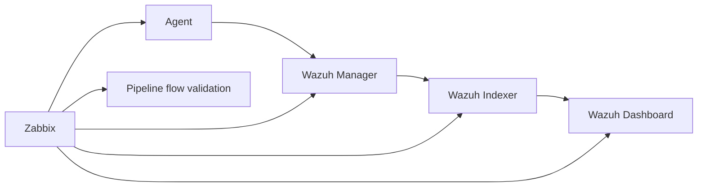

# Part 6 - From Monitoring to Trust: Operating Wazuh at Scale with Zabbix

*Part of the series: [Monitoring Wazuh with Zabbix](./README.md)*

---

## Introduction - The Problem That Scale Introduces

Throughout this series, we built a complete operational model on a single-node Wazuh deployment - deliberately. The fundamentals are clearer without the complexity of distributed systems, and every principle introduced in Parts 1 through 5 remains valid regardless of environment size.

But in real production environments, Wazuh is rarely a single system.

It is a distributed architecture. And distributed systems introduce a failure category that single-node monitoring cannot detect:

> **Partial failure.**

A single-node system is either running or it is not. A distributed system can be running in some components while silently broken in others - and from the outside, it can appear entirely healthy.

This is the most dangerous operational state:

> **False confidence - the system appears operational while visibility has been lost.**

This is the exact failure mode that this entire series has been designed to prevent. In distributed environments, it becomes significantly harder to detect - and significantly more important to address.

---

## Why Partial Failure Is the Critical Risk

In a distributed Wazuh deployment, consider the following scenario:

- Wazuh agents are sending events normally
- Wazuh manager is processing events and generating alerts
- The Wazuh indexer cluster becomes unstable - one node fails, cluster state degrades from `green` to `yellow`, then `red`
- Alerts are no longer being indexed
- The Wazuh dashboard shows no recent activity
- From the SOC perspective: no alerts are visible, no clear error is displayed, and process monitoring shows all services running

**What has happened:**

Detection is working. Visibility has been lost.

The pipeline did not break - it degraded at a specific stage, silently, while every surface-level check continued to pass. This is exactly the type of failure that process and resource monitoring alone cannot catch.

> **You must monitor not just whether components are running - but whether data is flowing through the entire pipeline.**

---

## The Full Wazuh Stack

Before designing monitoring for a distributed environment, it is essential to understand what each component does and what it risks losing when it fails.

| Component | Role | Impact if it fails |
|-|-|-|
| Wazuh agents | Collect and forward events from endpoints | No data enters the pipeline; detection gap begins immediately |
| Wazuh manager | Receives events, applies rules, generates alerts | No alerts generated; complete detection failure |
| Wazuh indexer (OpenSearch) | Stores and indexes alerts for search and analytics | Alerts generated but not stored; investigation and SOC visibility lost |
| Wazuh dashboard | Provides analyst interface to indexed data | Analysts cannot see alerts; operational visibility lost even if detection is intact |

A critical insight from this table:

> **The indexer and dashboard do not affect alert generation - but they directly affect whether your security team can see and act on alerts.**

Losing the indexer means losing the ability to investigate, correlate, and report. Losing the dashboard means analysts are blind even when the detection pipeline is intact. Both are forms of visibility loss - and both must be monitored.

---

## End-to-End Pipeline Validation

Monitoring individual components is necessary but not sufficient. You must also verify that **data flows correctly through the entire pipeline**.



*Figure 1: Zabbix must monitor both individual components and the flow of data between them.*

### End-to-end checks by pipeline stage

| Check | What it validates | Monitoring layer |
|-|-|-|
| Agent count and heartbeat | Events are entering the pipeline | Data Flow Integrity |
| `alerts.json` freshness | Manager is generating alerts | Data Flow Integrity |
| Indexer document ingestion rate | Alerts are being stored | Data Flow Integrity |
| Dashboard API responsiveness | Analysts can access stored data | Data Flow Integrity / end-user layer |

### Detecting a broken pipeline

Consider the failure scenario described in the introduction:

- `proc.num[wazuh-manager]` → returns `1` ✓
- CPU and memory → within normal ranges ✓
- `vfs.file.time[/var/ossec/logs/alerts/alerts.json,modify]` → timestamp advancing ✓
- Indexer cluster health → `red` ✗
- Dashboard shows no recent data ✗

Without pipeline-level monitoring, the first three checks pass and the problem goes undetected. With it, the indexer health check catches the failure immediately.

This is why **Data Flow Integrity remains the most critical monitoring layer** - even, and especially, in distributed environments.

---

## Component-Specific Monitoring

Each component of the Wazuh stack has distinct monitoring requirements. The following sections define what to monitor and how.

---

### Wazuh Manager

The monitoring items and triggers established in Part 3 apply directly:

- `proc.num[wazuh-manager]` - process health
- `vfs.file.time[/var/ossec/logs/alerts/alerts.json,modify]` - alert pipeline activity
- `log[/var/ossec/logs/ossec.log,"ERROR"]` - internal error detection
- Disk and CPU checks on the manager host

In multi-manager environments, apply identical monitoring to each manager node. This is where Zabbix templates (covered in the next section) become essential - you should not be configuring items manually for each node.

---

### Wazuh Indexer (OpenSearch)

The indexer is typically the most resource-intensive component and the most common source of silent pipeline failures. Monitoring it requires a combination of system-level checks and API-level checks.

#### System-level checks

Apply the standard infrastructure capacity checks from Part 3 to each indexer node:

- Disk usage (indexer nodes fill disks faster than manager nodes; consider tighter thresholds - warn at 75%, critical at 85%)
- CPU and memory utilisation
- JVM heap usage (see below)

#### Cluster health via HTTP agent

The most important indexer check queries the OpenSearch cluster health API directly.

Create a Zabbix **HTTP agent** item on the indexer host (or on a host with network access to the indexer):

| Field | Value |
|-|-|
| Name | `Wazuh Indexer - cluster health state` |
| Type | `HTTP agent` |
| URL | `https://localhost:9200/_cluster/health` |
| Request method | `GET` |
| Authentication | `Basic` (use indexer admin credentials) |
| SSL verify peer | `No` (for self-signed certificates on internal deployments) |
| Type of information | `Text` |
| Update interval | `60s` |
| Description | Queries the OpenSearch cluster health API. Returns a JSON object containing the cluster status field. |

To extract only the status field, add a **preprocessing step**:

| Step | Type | Parameters |
|-|-|-|
| 1 | JSONPath | `$.status` |

This item will now return one of three values: `green`, `yellow`, or `red`.

**Create triggers:**

| Trigger | Expression | Severity |
|-|-|-|
| Indexer cluster degraded | `last(/host/http.agent[...])="yellow"` | Warning |
| Indexer cluster critical | `last(/host/http.agent[...])="red"` | High |

**Cluster state meanings:**

| State | Meaning | Operational impact |
|-|-|-|
| `green` | All shards allocated; cluster healthy | Normal operation |
| `yellow` | Replica shards unassigned; primary shards intact | Degraded redundancy; data intact but at risk |
| `red` | Primary shards unassigned | Data loss possible; indexing may be failing |

#### JVM heap usage

The OpenSearch indexer is a Java application and relies heavily on heap memory. High heap usage causes performance degradation and, at extreme levels, out-of-memory failures.

Query heap usage via the OpenSearch nodes stats API:

| Field | Value |
|-|-|
| Name | `Wazuh Indexer - JVM heap usage` |
| Type | `HTTP agent` |
| URL | `https://localhost:9200/_nodes/stats/jvm` |
| Preprocessing | JSONPath: `$.nodes.*.jvm.mem.heap_used_percent` |
| Type of information | `Numeric (float)` |
| Units | `%` |

**Suggested trigger threshold:** JVM heap usage above 80% for 5 minutes → `Warning`.

#### Unassigned shards

Unassigned shards indicate that the cluster cannot place data correctly - often due to disk pressure, node failures, or misconfiguration.

| Field | Value |
|-|-|
| Name | `Wazuh Indexer - unassigned shards` |
| Type | `HTTP agent` |
| URL | `https://localhost:9200/_cluster/health` |
| Preprocessing | JSONPath: `$.unassigned_shards` |
| Type of information | `Numeric (unsigned)` |

**Trigger:** `last(...) > 0` → `Warning`. Any unassigned shards warrant investigation.

---

### Wazuh Dashboard

The dashboard does not affect alert generation, but it is the primary interface through which analysts interact with security data. Dashboard unavailability means analysts cannot see alerts, investigate incidents, or generate compliance reports.

> **Visibility lost at the human layer is still visibility lost.**

#### Service process check

| Field | Value |
|-|-|
| Name | `Wazuh Dashboard - process running` |
| Type | `Zabbix agent` |
| Key | `proc.num[wazuh-dashboard]` |
| Type of information | `Numeric (unsigned)` |

**Trigger:** `last(...) = 0` → `High`

#### HTTP endpoint availability

Verify that the dashboard is not just running as a process but is actually serving requests:

| Field | Value |
|-|-|
| Name | `Wazuh Dashboard - HTTP endpoint reachable` |
| Type | `HTTP agent` |
| URL | `https://[dashboard-host]:443` |
| Request method | `HEAD` |
| Expected HTTP status codes | `200,301,302` |
| SSL verify peer | `No` (for internal self-signed certificates) |
| Update interval | `60s` |

**Trigger:** Unexpected status code or connection failure → `High`

This check catches scenarios where the process is running but the web server has entered a broken state - a failure mode that process monitoring alone cannot detect.

---

### Wazuh Agents

Agent monitoring validates the first stage of the pipeline: are endpoint events actually entering the system?

The most effective agent-level check tracks the number of active agents connected to the manager. A sudden drop in agent count can indicate:

- a network partition between agents and the manager
- a manager configuration change that has disconnected agents
- a mass agent failure (e.g. following a bad deployment)

Query agent count via the Wazuh API:

| Field | Value |
|-|-|
| Name | `Wazuh - active agent count` |
| Type | `HTTP agent` |
| URL | `https://[manager-host]:55000/agents?status=active` |
| Authentication | Bearer token (Wazuh API credentials) |
| Preprocessing | JSONPath: `$.data.total_affected_items` |
| Type of information | `Numeric (unsigned)` |
| Update interval | `300s` |

**Trigger design:** Rather than a fixed threshold (which would require manual updates as agent count grows), use a percentage-based drop detection:

```
(last(/host/wazuh.agents.active) / avg(/host/wazuh.agents.active,1h)) < 0.8
```

This fires if the current agent count drops more than 20% below the one-hour average - catching sudden drops without requiring a hardcoded threshold that drifts out of date as the fleet grows.

---

## Scaling Monitoring with Templates and Macros

When monitoring a single host, items and triggers can be configured manually. When monitoring multiple Wazuh nodes, manual configuration becomes unmanageable - inconsistent, error-prone, and expensive to maintain.

**Zabbix templates** solve this by defining monitoring logic once and linking it to many hosts.

### Recommended template structure

| Template | Applied to | Contains |
|-|-|-|
| `Template Wazuh Manager` | All manager nodes | Process, alert log, ossec.log, disk, CPU checks |
| `Template Wazuh Indexer` | All indexer nodes | Cluster health, JVM heap, shard, disk, CPU checks |
| `Template Wazuh Dashboard` | All dashboard servers | Process, HTTP endpoint checks |

**Navigate to:** `Configuration → Templates → Create template`

Define items and triggers within the template exactly as you would on a host. Then link the template to each host:

`Configuration → Hosts → [Host] → Templates → Link new templates`

Any change to the template - a threshold adjustment, a new item, a trigger modification - propagates automatically to all linked hosts. This is the single most important operational efficiency gain available in Zabbix for multi-node environments.

### Host macros for environment flexibility

Templates become truly flexible when combined with macros. A macro is a variable that can be defined at the template level and overridden at the host level.

**Example macros for a Wazuh monitoring template:**

| Macro | Default value | Purpose |
|-|-|-|
| `{$WAZUH_ALERT_LOG}` | `/var/ossec/logs/alerts/alerts.json` | Alert log path (override if non-standard) |
| `{$DISK_WARN}` | `75` | Disk warning threshold (%) |
| `{$DISK_CRIT}` | `85` | Disk critical threshold (%) |
| `{$CPU_WARN}` | `90` | CPU warning threshold (%) |
| `{$ALERT_STALE_SECONDS}` | `600` | Alert log staleness threshold |

**Navigate to:** `Configuration → Templates → [Template] → Macros`

Use macros in item keys and trigger expressions:

```
vfs.file.time[{$WAZUH_ALERT_LOG},modify]
```

```
(now()-last(/host/vfs.file.time[{$WAZUH_ALERT_LOG},modify]))>{$ALERT_STALE_SECONDS}
```

Override a macro for a specific host where the threshold should differ - without creating a separate template:

`Configuration → Hosts → [Host] → Macros → Add host-level macro`

### Host groups for alert routing

Structure your monitored hosts into groups that reflect their function:

- `Wazuh Managers`
- `Wazuh Indexers`
- `Wazuh Dashboard`
- `Security Infrastructure`

Groups enable targeted alert routing in Actions (notify the infrastructure team for indexer alerts, the SOC team for manager alerts) and make `Monitoring → Problems` filterable by component type.

---

## Managing Complexity at Scale

As monitoring expands across multiple nodes and components, new operational challenges emerge.

### Alert routing by responsibility

| Component | Alert owner | Rationale |
|-|-|-|
| Wazuh managers | SOC / security operations | Direct impact on detection |
| Wazuh indexers | Infrastructure team | Storage and cluster management |
| Wazuh dashboards | Platform team | Service availability |
| Agents | SOC + endpoint team | Detection gap management |

Configure this routing through Action conditions in Zabbix, filtering by host group.

### Trigger dependencies in distributed environments

In a distributed system, a single root cause can generate a cascade of alerts across multiple components. Use trigger dependencies to suppress downstream alerts when the root cause is already known.

Example:
- Indexer node becomes unreachable
- Without dependencies: alerts fire for cluster health, JVM, disk, dashboard API, and agent connectivity simultaneously
- With dependencies: only "Indexer node unreachable" fires; all others are suppressed until the root cause is resolved

### Preventing alert storms

Alert storms - dozens of alerts firing simultaneously from a single root cause - are one of the most disorienting experiences an operations team can face during an incident. They obscure the root cause, overwhelm notification channels, and delay response.

In distributed environments, the risk of alert storms is significantly higher than in single-node deployments. Trigger dependencies, host group filtering, and careful severity assignment are the primary controls.

### Maintenance windows

During planned maintenance - upgrades, reconfigurations, node replacements - suppress alerts to avoid noise that distracts from the actual work.

**Navigate to:** `Configuration → Maintenance → Create maintenance period`

Define the affected hosts, the time window, and whether to suppress all problems or only specific severities.

---

## Operational Maturity - From Monitoring to SOC Integration

At scale, monitoring evolves beyond a technical configuration into an active component of security operations.

The question changes from:

> "Is the system running?"

to:

> **"Can we trust what we are - or are not - seeing?"**

### Monitoring maturity model

| Stage | Focus | Characteristics |
|-|-|-|
| Initial | Checks and alerts | Manual configuration; reactive |
| Intermediate | Alerting and escalation | Structured severity; defined ownership |
| Advanced | Pipeline validation | End-to-end checks; delivery reliability |
| Mature | SOC integration and continuous improvement | Every incident improves monitoring; monitoring drives response automation |

Most organisations reach the intermediate stage and stop. The advanced and mature stages - pipeline validation and SOC integration - are where monitoring becomes genuinely trustworthy rather than merely present.

### Integration with SOC workflows and automation

At the mature stage, Zabbix monitoring integrates directly with:

- **Incident management systems** - alerts automatically create tickets; resolution closes them
- **SOC alert channels** - monitoring problems appear alongside security alerts in the same operational view
- **Automated remediation** - specific alert types trigger automated responses (restart a service, clean a disk, notify an on-call engineer via PagerDuty)

**Example automation chain using n8n:**

```
Zabbix trigger fires
  → Webhook to n8n
    → n8n creates incident ticket in ITSM
    → n8n posts to SOC Slack channel
    → n8n triggers on-call notification via PagerDuty
    → On resolution: n8n closes ticket and posts confirmation
```

Monitoring becomes an **active control system** - not a passive observer.

### The alert delivery reminder at scale

As noted in Part 4, alert delivery failure is a real operational risk. This risk increases in distributed environments because:

- more notification channels are in use
- more webhook integrations exist, each with its own failure mode
- alert volume is higher, increasing the chance that a failed delivery is not noticed

Apply the delivery verification practices from Part 5 - `nodata()` triggers, regular channel testing, acknowledgment auditing - across all components in your distributed deployment.

> **A monitoring system that covers a distributed architecture but delivers alerts through a single unverified channel has not solved the delivery problem - it has scaled it.**

---

## The Core Truth of This Series

Monitoring is not about systems.

It is about trust.

A system can be running - all processes healthy, all dashboards green - while visibility has been silently lost. A partial failure in a distributed pipeline, a stalled indexer, a broken notification channel: any of these can create a state where the monitoring system reports normal while detection has stopped.

Monitoring ensures you know the difference.

> **If you cannot trust your visibility, you cannot trust your security.**

This has been the central argument of every article in this series - stated most simply in Part 1:

> The real risk is not an attack. It is not seeing the attack.

Everything built across these six articles - the Visibility Assurance Model, the three monitoring layers, the trigger design patterns, the alert delivery reliability framework, the operational maintenance discipline - serves this single purpose:

> **Ensuring that security visibility can be trusted at all times.**

---

## What You Have Built Across This Series

Stepping back across all six articles, you have constructed a complete operational model:

| Article | What it added |
|-|-|
| Part 1 | The case for monitoring: silent failure, loss of visibility |
| Part 2 | The design framework: Visibility Assurance Model, three layers, failure-first thinking |
| Part 3 | The implementation: items, triggers, testing, ownership |
| Part 4 | The alerting layer: severity, delivery reliability, escalation, notification design |
| Part 5 | The operational layer: signal quality, monitoring the monitor, maintenance discipline |
| Part 6 | The scale layer: distributed architectures, pipeline validation, partial failure, SOC maturity |

The operational chain is complete:

> **Detection → Monitoring → Alerting → Response → Maintenance**

Each stage depends on the one before it. If detection fails, there is nothing to monitor. If monitoring fails, alerting produces nothing. If alerting fails, response never happens. If maintenance fails, all of the above degrade silently over time.

---

## Final Thought

You are now beyond:

> "I can monitor Wazuh."

You understand:

> **How to ensure reliable security visibility in real environments - at any scale.**

The configuration built in this series is a starting point. As your environment grows, your operational knowledge deepens, and your team gains experience with real incidents, the monitoring system will evolve.

Keep testing it. Keep improving it. Keep asking whether the alerts you are receiving can be trusted - and whether the silence you are not receiving should be.

> **Reliable security is not built from detection alone.**  
> **It is built from trust in that detection.**

---

*Cyber security must be built in - not bolted on.*  
- **[SECaaS.IT](https://security-as-a-service.io/)**

---

*[← Part 5: Operating and Maintaining Monitoring](./Part-05-Operating-and-Maintaining-Monitoring.md) · [Series Overview →](./README.md)*
